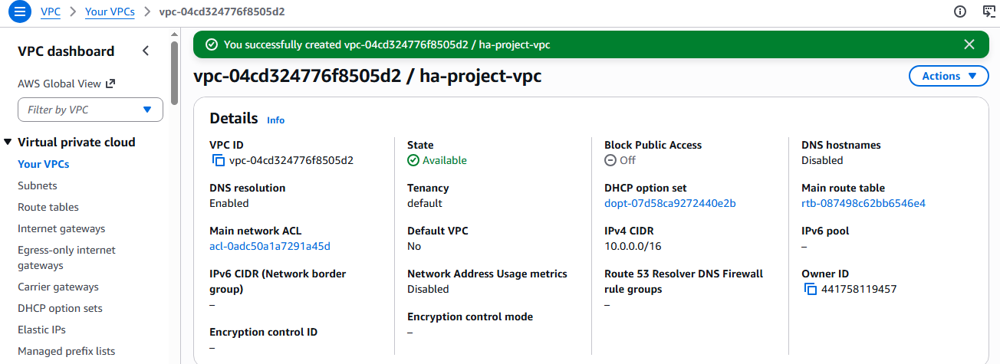
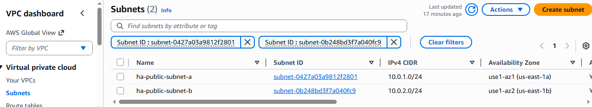
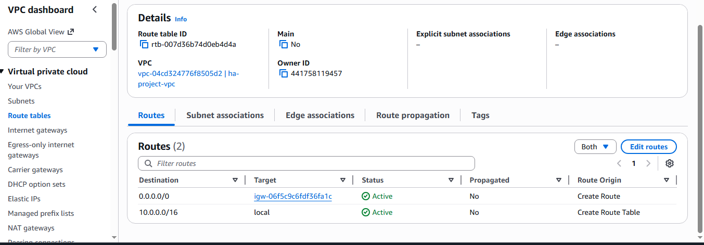
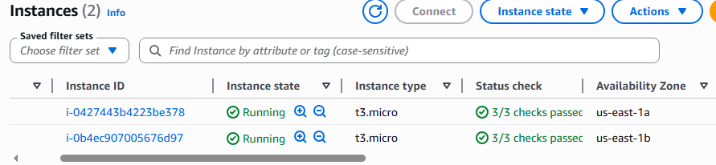
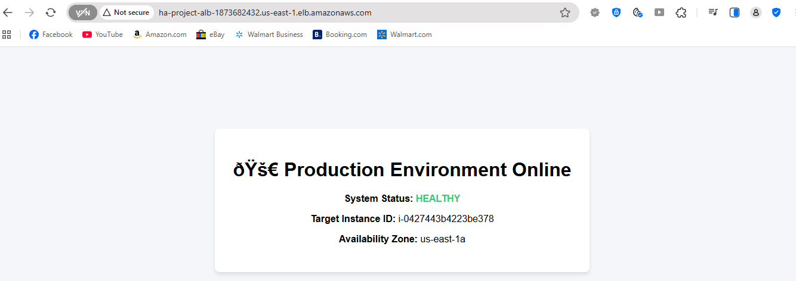

# aws-elastic-web-infrastructure
An elastic EC2 web server cluster orchestrated by an AWS Application Load Balancer.

# Highly Available & Fault-Tolerant Web Architecture on AWS

An automated, multi-Availability Zone (Multi-AZ) compute infrastructure designed to maintain 100% application uptime, optimize operational costs, and automatically recover from localized data center failures.

## 🏗️ Architecture Overview

This project bypasses manual server configuration in favor of an automated, decoupled infrastructure-as-a-service layout. It utilizes an Elastic Load Balancer (ALB) to orchestrate incoming public web requests across an auto-scaling cluster of EC2 web servers distributed across physically isolated AWS data centers.

### Key Infrastructure Pillars:
* **High Availability:** Active-Active dual-zone compute deployment.
* **Fault Tolerance:** Automated health probing and instantaneous target replacement.
* **Security (Least Privilege):** Decoupled Security Groups isolating public web traffic to the ALB, forcing private/restricted ingress to backend instances.
* **Cost Optimization:** Elastic provisioning that scales down down to zero active runtime fees when human administration steps away.

---

## 🛠️ Network & Infrastructure Components

### 1. The Network Foundation (`ha-project-vpc`)
A custom Virtual Private Cloud configured with a standard `/16` CIDR block block to handle broad network allocation. 
* **Public Subnets:** Two independent subnets mapped across `us-east-1a` and `us-east-1b` to distribute workloads across physical fault domains.
* **Internet Gateway (IGW) & Routing:** A dedicated public route table explicitly maps `0.0.0.0/0` traffic directly through the IGW, allowing external users to hit our web layers.

### 2. The Compute & Automation Layer
* **Launch Template (`ha-web-template`):** A reusable blueprint defining our baseline compute specs (`t2.micro`), security configurations, and a customized shell User Data script that automates the deployment of the web application upon boot.
* **Auto Scaling Group (`ha-web-asg`):** Configured with a desired capacity of `2` and a maximum capacity of `4` instances, ensuring consistent multi-AZ redundancy without human intervention.

### 3. Traffic Management & Elastic Load Balancing
* **Application Load Balancer (`ha-project-alb`):** An internet-facing traffic controller mapping standard incoming HTTP Port 80 traffic.
* **Target Group (`ha-web-targets`):** A logical routing pool governed by Elastic Load Balancing health checks. If an individual instance fails its `/` path check, it is automatically drained of traffic and replaced by the ASG.

---

## 📸 Verification & Visual Proof

### Phase 1: Isolated VPC Infrastructure Topology
The custom network footprint was established using a `/16` CIDR block block to handle isolated data control planes.

### Phase 2: Multi-AZ Subnet Allocation
To prevent single points of failure at the data center level, subnets were distributed across distinct Availability Zones.

### Phase 3: Internet Gateway & Route Table Mapping
Explicit route table definitions were mapped to link the public subnets to the Internet Gateway, establishing external data highways.

### Phase 4: Elastic Compute Layer Provisioning
The Auto Scaling Group successfully deployed multiple synchronized compute instances across separate physical fault domains.

### Phase 5: End-to-End Application Delivery via ALB
Accessing the architecture via the Application Load Balancer's public URL proves operational routing, target health status stability, and secure ingress rules.

## 🔧 Engineering Challenges & Solutions

### 1. The Routing Obstacle (504 Gateway Time-out Mitigation)
* **Issue:** Initial infrastructure testing yielded a `504 Gateway Time-out` when attempting to load the application. 
* **Root Cause Evaluation:** The custom public subnets were defaulting to the VPC's Main Route Table, rendering them completely blind to the Internet Gateway.
* **Resolution:** Modified subnet associations, explicitly linking both public subnets to the custom public route table mapping `0.0.0.0/0 -> IGW`.

### 2. Auto Scaling Group Ingress Misconfiguration
* **Issue:** The Load Balancer targets originally sat at `0 registered targets` despite instances showing as healthy in the compute console.
* **Resolution:** Adjusted Advanced Configuration settings inside the Auto Scaling Group attributes to explicitly register instances with `ha-web-targets` upon launch, instantly resolving target discovery issues.
